A (very) short intro to productivity tools for devs
=============================

---


<ul style="list-style: none;">
	<li><i class="fa fa-github" aria-hidden="true"></i>&nbsp;&nbsp;[Wouter Groeneveld](https://github.com/wgroeneveld/)</li>
	<li><i class="fa fa-calendar" aria-hidden="true"></i>&nbsp;&nbsp;09/05/2017 </li>
</ul>

___

## Agenda

* What is productivity?
* Who cares?
* (Lots of) mechanics
* (Lots of) examples
* Philosophy
* External resources

---

## What is productivity?

> Productivity describes various measures of the efficiency of production

Developers are getting less efficient, not more!

___

### Plowing the field (V. Van Gogh, 1882)

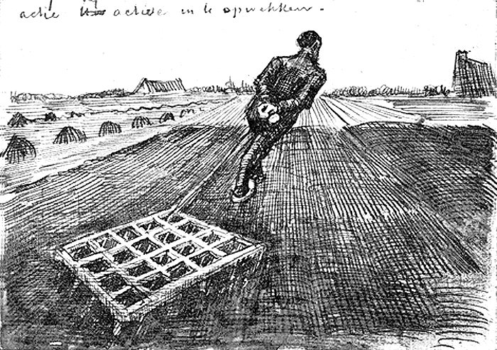

___

### Plowing the field (2000)


___

### Plowing the field (2017)


___

## Who cares?
<!-- .slide: data-background="#85ba62" -->
Good for the company you work for...

But also and most importantly: good for yourself! 


___

How long would you want to be this person?


___

## If it's that obvious...

Then **why aren't we doing it**?

* It's too difficult
* It's something you're not aware of (not anymore!)
* time <i class="fa fa-clock-o" aria-hidden="true"></i> pressure: takes too long to learn/master
* I'm too lazy

The right lazy people **are** productive and use the tools.

___
<!-- .slide: data-background="resources/fountainpen.jpg" -->

### Know your tools!

___

<!-- .slide: data-background="resources/monbento.jpg" -->

> "The Medium is the Message" - Marshall McLuhan

&nbsp;

&nbsp;

&nbsp;

&nbsp;

&nbsp;

---

## Mechanics

> We are struck with technology when what we really want is just stuff that works.

Concentrate on **essence**, not on **ceremony**. 

___

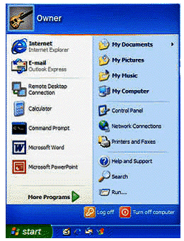

How often do you click in this thing to get something started?

___

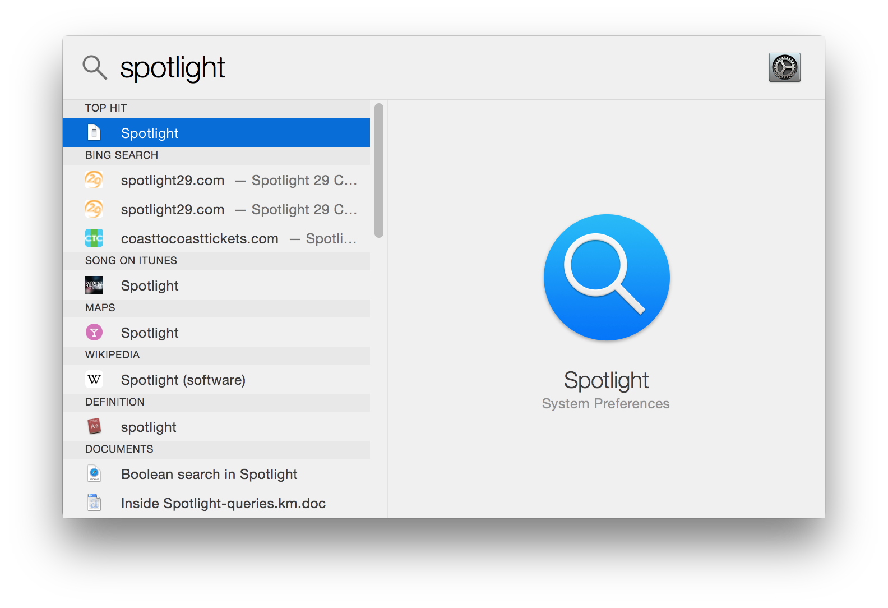

* Mac alternative: https://www.alfredapp.com/
* Windows: http://www.launchy.net/
___

## Concentrate on **essence**, not on **ceremony**. 

Ceremony: bootstrapping. To get where you want to be.

Essence: You're there now. Do what you want to do. 

___

<!-- .slide: data-background="resources/bookmark.jpg" -->

---

## Mechanics: Launchers

> Search always trumps navigation.


___

### Launching programs

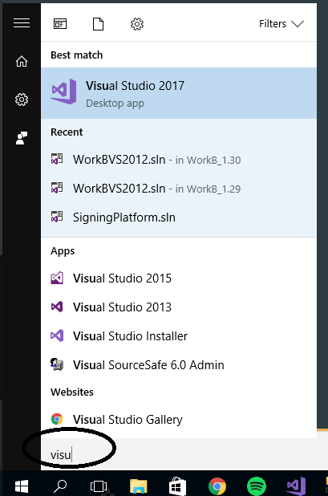

* http://windowsreport.com/desktop-app-launchers-windows-10/ 
* Unix
* Mac spotlight + alternatives

___

### Launching (menu) actions in programs

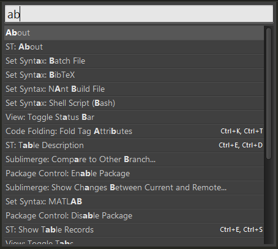

CMD+SHIFT+P
<br/>
Mac: help search

---

## Mechanics: History

> Those who don't rely on their history are doomed to type it again.

Or use snippet managers like http://www.phraseexpress.com/ or https://www.phraseexpander.com/
___

### Clipboard history

* Mac: http://www.clipmenu.com/
* Windows: http://www.nakka.com/soft/clcl/index_eng.html

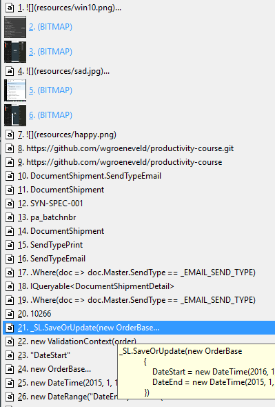

___

### Cmdline history

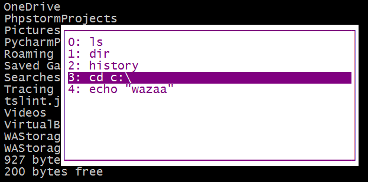

* Windows: `F7`, `F8` (Within one session) > Arrow up/down
* Unix: "history", `set -o vi`, ESC + /

http://mridgers.github.io/clink/

---

## Mechanics: focus

> It is during our darkest moments that we must focus to see the light.

(Aristotle)
___

<!-- .slide: data-background="resources/distracted_walker.jpg" -->

___


### Distraction-free mode

F11<br/>
<br/>

* Everywhere available nowadays (IDE, OS, TextEditor, ...)
* Turn off notifications!
* Don't live in your mailbox!
* Throw out your cellphone! 
* Browser extensions that **hide images**

Introduce **Quiet time**

___

http://focusmanifesto.s3.amazonaws.com/FocusFree.pdf


___

### Monitors++

(and keyboards/mice, pair programming)


---

## Mechanics: automatisation

> I couldn't tell you in any detail how my computer works. I use it with a layer of automation.

___

### Write scripts to do the work for you

* File manipulation on regular basis
* syncing directories: `rsync`
* encoding/decoding, shrinking, ... 
* Python & Ruby are excellent choices here

___

### Whatever you do: don't reinvent the wheel!

+1mil. Libraries of all languages available.

* C# - https://www.nuget.org/
* Ruby - https://rubygems.org/
* PHP - https://packagist.org/
* Node - https://www.npmjs.com/
* ...

___

### Automate repetetive commands: F5 F5 F5 F5 ...

Build tool plugins:


Livereload - https://www.npmjs.com/package/gulp-livereload


___

### Automate the web: selenium

WebDriver. Kan in C#, python, ... 

___

### Automate between APIs: IFTTT

https://ifttt.com/

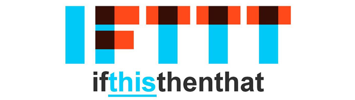

___

### Use commandline variants of programs

* `SVN` instead of Tortoise
* `wget` instead of browsing

Integrate them somewhere

___

### Automate clicks in your OS

Automator example in OSX

___

### Don't exaggerate: YAGNI

http://thehumbleprogrammer.com/mastering-yagni/


---

## Mechanics: eliminate duplication

___

### Use version control!

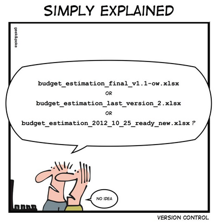

... Or use dropbox/GDrive/...

___

### Canonical build PCs

Bob's PC === Jeff's PC
Automate with Vagrant/puppet/...

Alternative: Ninite - Install and Update your programs all at once


___

### Symlinks

* Unix: `ln -s link target`
* Windows: junction
* Windows 10: `mlink /D link target`

___

### Keep your documentation in one place

* Keep a personal Wiki
* Github pages + Static web engines like https://gohugo.io/
* Generate documents based on code - https://msdn.microsoft.com/nl-be/library/ff657806.aspx
* Analog Journaling (sometimes) > Digital

---

## Lots of examples! 

___

### TDD

Automate tests, be productive, run stuff faster, get notifications faster, ...

Build tools, etc etc

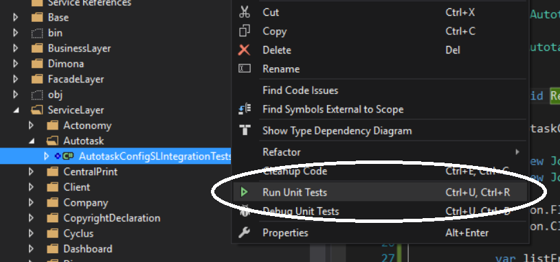

___

### Statistics generation

teamcity build statistics, code coverage automated, ... 

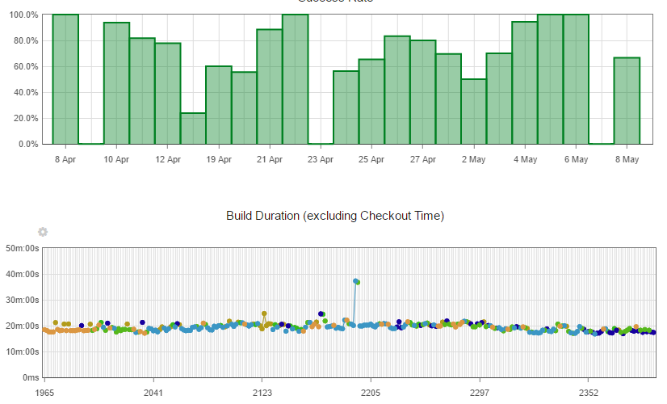

___

### Getting work done using reflection

* Sometimes reflection is more elegant
* Sometimes reflection introduces complexity for nothing
* Depends on the language you'll be using

(Example)

---

## Again: Know your Tools


Requirements:

macro recording, cmdline-able, regexp search/replace, +1 registers, crossplatform, your requirement here?

___ 

### The perfect Tool: an IDE


* IntelliJ platform
* Eclipse
* Visual Studio
* ... 

Daily (heavyweight) work done here.<br/>
So why not be productive with it?


___

### The perfect Tool: an Editor - the new gen.


**Get to know them** - put in the extra time!

___

### The perfect Tool: an Editor - the old gen.

VI, Emacs - Yes, they are still **very relevant**!

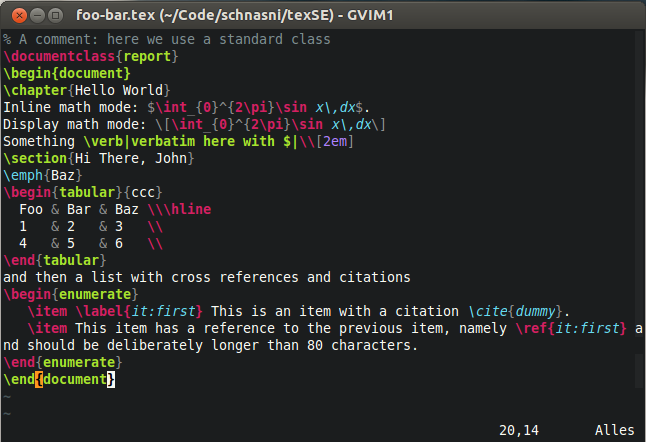

Vi shortcuts in cmdline: `set -o vi` (incl insert mode)

___

### Vi and recording


https://nathanleclaire.com/blog/2013/10/27/5-cool-unix-hacks-for-fun-and-productivity/

___

### The perfect Tool: cmdline

Cygwin, grep, sed, ...

http://www.brainbaking.com/wiki/unix/cmd/

```cmd
find . -name "*.csproj" -exec grep -H 2 "utilities" {} \;
sed 's/<br/>(.*<br/>)/regel:<br/>1/g' log.tmp >> $logfile
cat file | sed -e 's/replace/by/g' -e 's/other/new/g' 
echo 'holy shit I am seriously impressed'
```

___

### The perfect tool: which language to use when?

Use a "real" (script) language to automate chores.<br/><br/>

Why? Unit **testability**, vs shell/Bash script. <br/>
Why? **Keep behaviour in (unit tested) code**.

---

## Philosophy of a productive person

> Productivity beyond coding: '(life) hacking'


___ 

### Be a polyglot


___

### Getting Thigns Done (GTD)

> Having a system that works and gets the work done. 

https://www.wunderlist.com/


___

### John Locke's system

Trying to be productive is older than you might think... 

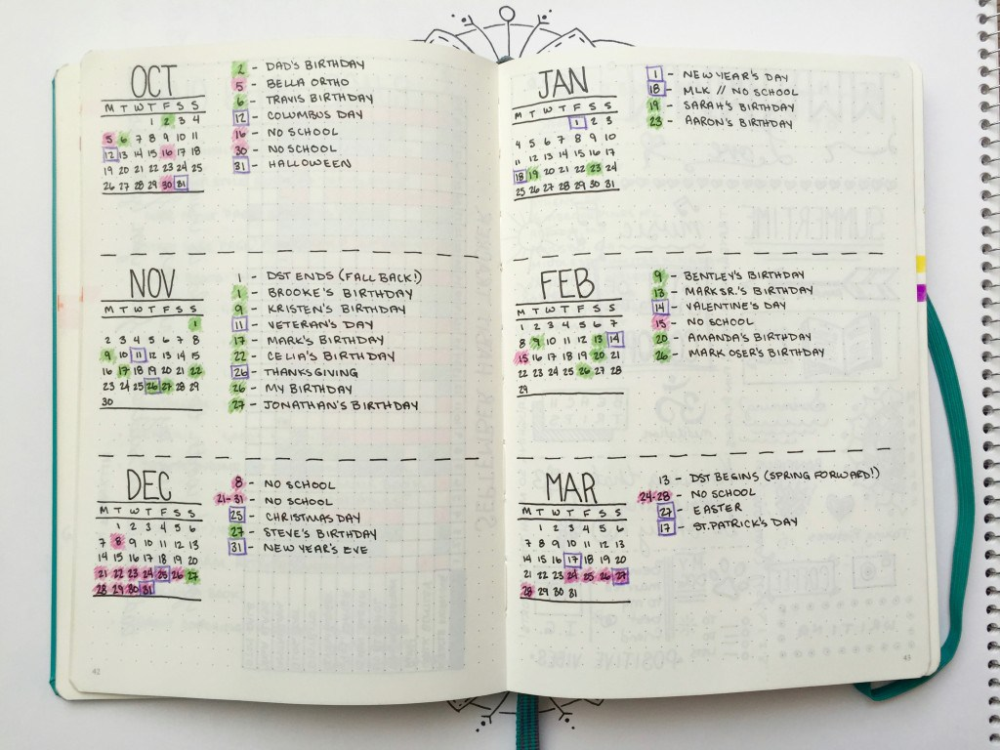

---

## Resources

* The Productive Programmer: http://nealford.com/books/productiveprogrammer
* Leo Babauta's Focus manifesto: http://focusmanifesto.s3.amazonaws.com/FocusFree.pdf
* ReSharper Documentation: https://www.jetbrains.com/resharper/documentation/documentation.html
* Download Cygwin: https://cygwin.com/install.html
* Life Hacker: http://lifehacker.com/
* Learning the Vi and Vim Editors: http://shop.oreilly.com/product/9780596529833.do

